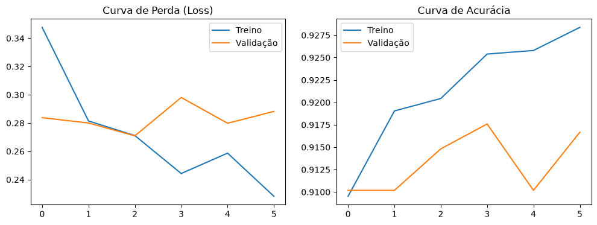

# 🛡️ Detector de Fake News - Deep Learning (LSTM)

Este repositório contém o desenvolvimento de uma solução baseada em Inteligência Artificial para a classificação automática e detecção de notícias falsas em língua portuguesa. O projeto foi desenvolvido como parte dos requisitos obrigatórios da Atividade Prática da disciplina de Deep Learning.

---

## 📖 1. Definição do Problema e Contexto
O avanço da desinformação digital (Fake News) gera impactos severos no comportamento social, na estabilidade econômica e nas decisões políticas. Identificar e mitigar a propagação de boatos manualmente é uma tarefa lenta e ineficiente devido ao volume massivo de dados gerados diariamente.

**Impacto e Relevância**: A desinformação afeta a sociedade civil como um todo, manipulando a opinião pública e minando a confiança em instituições de relevância real.
**Justificativa do Deep Learning**: O uso de Redes Neurais Recorrentes (especificamente a arquitetura LSTM) justifica-se pela capacidade intrínseca dessas redes de capturar dependências sequenciais de longo prazo e o contexto semântico das palavras dentro de uma frase ou parágrafo, superando abordagens estatísticas tradicionais.
**Limitações da Solução**: O modelo baseia-se exclusivamente em padrões textuais, estilísticos e sintáticos presentes no corpo do texto. Ele não realiza checagem de fatos (*fact-checking*) contra bancos de dados governamentais ou agências de notícias externas.

---

## 🎯 2. Objetivo da Solução
Desenvolver um sistema classificador binário capaz de analisar o texto bruto de uma notícia fornecida pelo usuário, processar sua estrutura semântica e prever se ela possui características textuais de uma notícia verdadeira ou de uma desinformação (Fake News), exibindo o veredito e a probabilidade calculada em uma interface gráfica local.

---

## 📊 3. Base de Dados e Pré-Processamento
 projeto utiliza dados reais derivados do ecossistema do jornalismo brasileiro.
**Origem dos Dados**: *Fake.br-Corpus*.
**Estrutura e Tipo**: Dados puramente textuais de notícias rotuladas de forma binária (`fake` ou `true`).
* **Pré-Processamento e Tratamento Obrigatório**: 
  * Conversão de todos os caracteres para minúsculo para padronização.
  * Remoção completa de pontuações, caracteres especiais e ruídos textuais.
  * **Estratégia de Balanceamento e Viés**: Devido à distribuição concentrada do dataset original (onde as classes eram agrupadas em blocos sequenciais), foi aplicada uma estratégia de embaralhamento randômico completo (*shuffle*) antes da divisão, mitigando o viés de ancoragem do modelo.
  * **Tokenização e Padding**: Criação de um vocabulário limitado a 10.000 palavras mais frequentes (`max_words`), utilizando uma palavra fora do vocabulário padrão (`<OOV>`). O truncamento e o preenchimento padronizado pós-texto (*padding post*) foram fixados em sequências de 300 tokens (`max_len`).
  * **Divisão dos Dados**: Os dados foram divididos na proporção de 70% para Treino, 15% para Validação e 15% para Teste (utilizando amostragem estratificada).

---

## 🤖 4. Modelagem e Arquitetura em Deep Learning
A arquitetura da rede neural foi construída sequencialmente utilizando a API Keras/TensorFlow:

1. **Camada de Embedding**: Dimensão de entrada de 10.000 (tamanho do vocabulário) e dimensão de saída de 128 para representação vetorial densa das palavras.
2. **Camada LSTM**: 64 unidades neurais para processamento e retenção da ordem sequencial do texto.
3. **Camada Dropout (0.5)**: Estratégia crucial adotada contra *overfitting*, desativando aleatoriamente 50% dos neurônios durante o treino.
4. **Camada Densa Intermediária**: 16 neurônios com função de ativação `ReLU` para introduzir não-linearidade.
5. **Camada Dropout (0.3)**: Segunda barreira de regularização contra coadaptação de pesos.
6. **Camada Densa de Saída**: 1 neurônio com função de ativação `Sigmoid`, ideal para retornar uma probabilidade contínua entre 0 e 1 em classificações binárias.

* **Hiperparâmetros de Treino**:
  * **Otimizador**: Adam.
  * **Função de Perda**: Binary Crossentropy (Entropia Cruzada Binária).
  * **Batch Size (Tamanho do Lote)**: 64.
  * **Épocas**: Configurado para um teto de até 10 épocas.
  * **Prevenção de Overfitting**: Implementação do callback `EarlyStopping` configurado para monitorar a perda de validação (`val_loss`), com paciência de 3 épocas e restauração dos melhores pesos automáticos. O treinamento foi interrompido com sucesso na **Época 4**, garantindo a melhor capacidade de generalização do modelo.

---

## 📈 5. Avaliação dos Resultados
O modelo demonstrou um desempenho equilibrado e de alta confiabilidade ao ser submetido aos dados de teste (dados nunca vistos durante o treinamento):

### Relatório Quantitativo de Métricas
* **Acurácia Geral (Accuracy)**: 93% 
* **Precisão (Precision)**: 91% para Fake | 96% para True 
* **Recall (Sensibilidade)**: 96% para Fake | 90% para True 
* **F1-Score**: 94% para Fake | 93% para True 

### Matriz de Confusão 



```text
[[488   52]   -> [Notícias Verdadeiras Corretas,  Falsos Alertas (Falsos Positivos)]
 [ 20  520]]  -> [Falsos Negativos (Passaram),   Fake News Capturadas Corretamente]